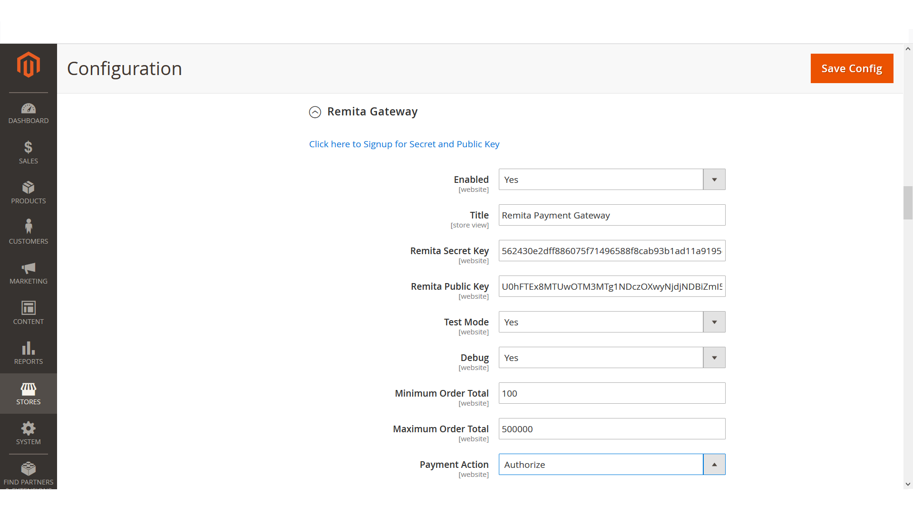

# Remita Magento2 Payment Gateway

---
- [Overview](#Overview)
- [Installation](#Installation)
- [Usage](#Usage)
- [Contributing](#Contributing)

---
## Overview

The Remita Magento2 Payment Plugin allows store admins to integrate various payment methods into their Magento webshop easily. For a comprehensive overview of features and services, please visit [Remita's official website](https://www.remita.net).

 



---

## Installation

1. Open your command line and navigate to the installation directory of your Magento 2 store.

2. Run the following commands:

```bash
composer require systemspecs/remita-magento2-payment-gateway
```
* This will update the dependencies.

Enable the module and update configurations:

```bash
php bin/magento module:enable SystemSpecs_Remita --clear-static-content
php bin/magento setup:upgrade
php bin/magento setup:di:compile
```

The plugin is now installed and ready for use.

---
## Usage

1. Log into the Magento Admin panel
2. Go to *Stores* > *Configuration*
3. Go to *Sales*, select *Payment Methods*
4. Scroll down to find the Remita Settings
5. Enter the public key and secrete key. You can find these keys in the [Remita Gateway Admin Panel](https://login.remita.net/remita/registration/signup.spa)
6. Enable the desired payment methods and set allowed countries
7. Save the settings


### Useful links
* Join our Slack Developer/Support channel on [slack](http://bit.ly/RemitaDevSlack)
    
### Support
- For all other support needs, support@remita.net

## Contributing
- To contribute to this repo, follow these guidelines for creating issues, proposing new features, and submitting pull requests:

Fork the repository.
1. Create a new branch: `git checkout -b "feature-name"`
2. Make your changes and commit: `git commit -m "added some new features"`
3. Push your changes: `git push origin feature-name`
4. Submit a Pull Request (PR).
